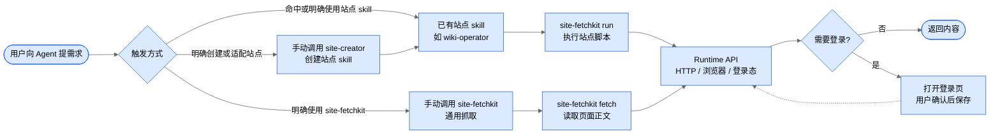

# site-fetchkit

让 Agent 通过 CLI/Runtime 读取网站内容、复用登录态，并执行站点 skill 脚本。

安装后会提供两个基础 skill：

- `site-fetchkit`：手动调用的通用获取与运行时 skill，也供站点 skill 调用底层能力。
- `site-fetchkit-site-creator`：为新网站创建或适配站点 skill。

`site-fetchkit` 不声明“普通链接默认兜底”的路由策略。是否把未命中专用 skill 的 URL 交给它处理，应由用户自己的全局或项目 `AGENTS.md` 决定。

## 安装

```bash
npm install -g site-fetchkit
site-fetchkit init
```

`init` 会安装基础 skill、创建状态目录，并安装 Playwright 使用的浏览器内核。

如果基础 skill 已存在，默认不会覆盖。需要重新安装基础 skill 时执行：

```bash
site-fetchkit init --force
```

## 使用入口



包本身只提供能力，不替用户决定链接路由。常见用法有三类：

- 已有站点 skill：由站点 skill 编排解析流程，脚本内部调用 `site-fetchkit`。
- 手动使用通用抓取：用户明确要求用 `site-fetchkit` 获取页面内容。
- 创建新站点 skill：用户明确要求用 `site-fetchkit-site-creator` 接入新网站。

## 读取已有站点内容

当站点已经有对应 skill，比如 `wiki-operator`、`docs-operator`、`ops-operator`，直接向 Agent 提需求。

示例：

> 获取这个 wiki 页面里的上行参数：`https://internal-wiki.example.com/pages/viewpage.action?pageId=123`

Agent 会调用对应站点 skill。站点 skill 负责业务解析，底层通过 `site-fetchkit` 复用登录态、HTTP 请求或浏览器上下文。

## 手动通用抓取

当你明确想让 `site-fetchkit` 直接读取一个页面时，可以这样对 Agent 说：

> 使用 site-fetchkit 获取这个页面正文：`https://example.com/doc/123`

Agent 会使用 `site-fetchkit fetch` 做通用抓取。通用抓取适合标题、正文、简单 DOM 内容，不保证能完成复杂业务结构化解析。

如果页面需要登录，Agent 会打开登录窗口。你完成登录后回复“已登录”，Agent 再保存登录态并重试。

## 可选路由规则

如果你希望“未命中专用 skill 的网页读取”默认交给 `site-fetchkit`，需要在自己的全局或项目 `AGENTS.md` 中声明，例如：

```md
当用户提供网页链接并要求读取标题、正文或摘要，且没有命中更具体的站点 skill 时，使用 site-fetchkit。
```

这属于使用者自己的 Agent 路由策略，不是 `site-fetchkit` 包的默认假设。

## 创建新站点 skill

当一个网站需要长期稳定读取，或者通用抓取无法满足结构化解析时，让 Agent 使用 `site-fetchkit-site-creator` 创建站点 skill。

示例：

> 使用 site-fetchkit-site-creator，帮我给内部 wiki 创建一个站点 skill。后续我给你 wiki 页面链接时，你能提取页面标题、正文、章节和接口参数。

Agent 会完成：

1. 判断站点标识和 skill 名称。
2. 创建站点 skill。
3. 验证新 skill 是否能读取代表性页面。
4. 在需要登录时引导你登录。
5. 根据页面结构调整读取方式。

创建完成后，日常读取内容交给新生成的站点 skill，不再使用 `site-fetchkit-site-creator`。

## Wiki 示例

用户希望接入一个内部 Confluence wiki：

> 使用 site-fetchkit-site-creator，为内部 wiki 创建一个站点 skill。我要获取 wiki 页面里的标题、正文、章节和接口参数。

后续用户给 wiki 链接时，命中生成的 wiki skill：

> 获取这个 wiki 页面里的上行参数：`https://wiki.example.com/pages/viewpage.action?pageId=<page-id>`

Agent 使用 wiki skill 编排解析流程，wiki skill 底层通过 `site-fetchkit` 读取页面。登录态过期时，Agent 会打开登录窗口并等待你确认“已登录”，然后继续完成读取。

## 两个 skill 的边界

`site-fetchkit` 负责通用获取和运行时能力：

- 被用户手动调用时，读取页面标题、正文或简单 DOM 内容。
- 被站点 skill 调用时，提供登录态、请求上下文和浏览器上下文。
- 它不创建、不改造站点 skill。
- 它不决定普通 URL 的默认路由。

`site-fetchkit-site-creator` 负责创建能力：

- 新网站需要长期适配时才使用。
- 它生成 `SKILL.md`、入口脚本和 adapter。
- 创建完成后，内容读取交给新生成的站点 skill。

## 站点脚本可用能力

站点 skill 脚本可以从 `site-fetchkit` 导入：

```js
import {
  ensureAuthenticated,
  createRequestContext,
  createBrowserContext,
  createPublicBrowserContext,
  htmlToText,
} from "site-fetchkit";
```

- `ensureAuthenticated`：检查并维护站点登录态。
- `createRequestContext`：创建带登录态的 HTTP 请求上下文。
- `createBrowserContext`：创建带登录态的浏览器上下文。
- `createPublicBrowserContext`：创建不带登录态的浏览器上下文。
- `htmlToText`：把 HTML 转成纯文本。

## 底层命令

CLI 是 skill 的执行内核，不是主要用户入口。skill 底层会按需调用 `site-fetchkit create-site`、`site-fetchkit run`、`site-fetchkit login`、`site-fetchkit complete-login` 和 `site-fetchkit fetch`。
