# site-fetchkit

让 Agent 通过 `site-fetchkit` CLI/Runtime 编排网页内容获取、登录态复用和站点 skill 脚本执行。

安装后会提供两个基础 skill：

- `site-fetchkit`：CLI/Runtime 编排规则。用于约束 Agent 如何调用 `fetch`、`run`、`login` 和 Runtime API；可以直接获取通用网页内容，但不是具体站点解析 skill。
- `site-fetchkit-site-creator`：为新网站创建或适配站点 skill。

`site-fetchkit` 包本身只提供能力，不替用户决定普通链接的默认路由。是否把未命中专用 skill 的 URL 交给 `site-fetchkit`，应由用户自己的全局或项目 `AGENTS.md` 决定。

## 安装

需要 Node.js 20+。通用抓取和无头浏览器 Runtime 依赖系统 Google Chrome；可见登录流程依赖 Playwright 管理的 Chromium。

```bash
npm install -g site-fetchkit
site-fetchkit init
```

`init` 会准备状态目录、安装内置 skill，并检查系统 Chrome 和 Playwright Chromium 是否可用；它不会自动安装浏览器。

如果提示 Playwright Chromium 缺失，执行：

```bash
site-fetchkit install-browser
```

如果基础 skill 已存在，默认不会覆盖。需要重新安装时执行：

```bash
site-fetchkit init --force
```

## 使用入口

```mermaid
%%{ init: { "flowchart": { "nodeSpacing": 60, "rankSpacing": 60 }, "theme": "neutral" } }%%
flowchart LR
    User([用户向 Agent 提需求])
    Route{触发方式}
    Existing["已有站点 skill<br/>如 wiki-operator"]
    Guide["site-fetchkit<br/>CLI / Runtime Guide"]
    Creator["site-fetchkit-site-creator<br/>创建站点 skill"]
    RunScript["site-fetchkit run<br/>执行站点脚本"]
    Fetch["site-fetchkit fetch<br/>通用页面读取"]
    API["Runtime API<br/>HTTP / 浏览器 / 登录态"]
    Login{需要登录?}
    Save["site-fetchkit login<br/>用户确认后保存状态"]
    Result([返回内容或结构化结果])

    User --> Route
    Route -->|命中或明确使用站点 skill| Existing
    Route -->|明确使用 site-fetchkit| Guide
    Route -->|明确创建或适配站点| Creator
    Existing --> RunScript
    Creator --> Existing
    RunScript --> API
    Guide --> Fetch
    Fetch --> API
    API --> Login
    Login -->|否| Result
    Login -->|是| Save
    Save -.-> API

    style User fill:#dbeafe,stroke:#2563eb
    style Route fill:#dbeafe,stroke:#2563eb
    style Existing fill:#dbeafe,stroke:#2563eb
    style Guide fill:#dbeafe,stroke:#2563eb
    style Creator fill:#dbeafe,stroke:#2563eb
    style RunScript fill:#dbeafe,stroke:#2563eb
    style Fetch fill:#dbeafe,stroke:#2563eb
    style API fill:#dbeafe,stroke:#2563eb
    style Login fill:#dbeafe,stroke:#2563eb
    style Save fill:#dbeafe,stroke:#2563eb
    style Result fill:#dbeafe,stroke:#2563eb
```



常见用法有三类：

- 已有站点 skill：由站点 skill 编排业务解析，底层通过 `site-fetchkit run` 和 Runtime API 复用登录态与内容获取能力。
- 直接通用读取：用户明确要求用 `site-fetchkit`，或路由规则允许把未命中专用 skill 的网页读取交给 `site-fetchkit fetch`。
- 创建新站点 skill：用户明确要求用 `site-fetchkit-site-creator` 接入新网站。

## 读取已有站点内容

当站点已经有对应 skill，比如 `wiki-operator`、`docs-operator`、`ops-operator`，用户直接提出业务目标即可。

示例：

> 获取这个 wiki 页面里的上行参数：`https://internal-wiki.example.com/pages/viewpage.action?pageId=123`

Agent 应调用对应站点 skill。站点 skill 负责业务解析，底层通过 `site-fetchkit run` 执行脚本，脚本再按需使用 `createRequestContext`、`createBrowserContext` 或 `htmlToText`。

## 直接通用读取

当用户明确想让 `site-fetchkit` 直接读取页面，或全局/项目规则允许它处理未命中专用 skill 的网页读取时，Agent 使用：

```bash
site-fetchkit fetch "https://example.com/doc/123"
```

`fetch` 使用后台浏览器模式读取页面，默认等待 `domcontentloaded`，短暂等待 `networkidle`，然后抽取 `main, article, body` 中第一个命中的元素。输出默认是 JSON。

常用选项：

```bash
site-fetchkit fetch "<url>" --format text
site-fetchkit fetch "<url>" --output result.json
site-fetchkit fetch "<url>" --wait-selector ".content"
site-fetchkit fetch "<url>" --extract-selector "article"
site-fetchkit fetch "<url>" --timeout 60000
```

如果要复用某个站点已保存的登录态：

```bash
site-fetchkit fetch "<url>" --site wiki
```

`--site` 只在该站点已有登录态时加载 `storageState`；没有登录态时会退回公开浏览器上下文。若页面返回登录页或空内容，先执行 `site-fetchkit login` 保存状态，再重试。

通用读取只适合标题、正文、HTML 和简单 DOM 内容。如果需要稳定提取章节、接口参数、业务字段或站点 API 结果，应创建或定制站点 skill。

## 登录态维护

首次登录某个站点时执行：

```bash
site-fetchkit login <site> --url "<setup-or-target-url>"
```

`login` 会打开可见浏览器，跳转到 setup URL，并在终端等待用户按 Enter。用户确认登录完成后，CLI 会保存 `storageState`，关闭浏览器上下文，并记录 setup URL。后续同一站点可省略 `--url`：

```bash
site-fetchkit login <site>
```

登录态目录默认位于：

```text
~/.agents/state/site-fetchkit/
```

如果用户提前关闭浏览器，`login` 会尝试从本地 profile 重新提取登录态。

## 可选路由规则

如果希望“未命中专用 skill 的网页读取”默认交给 `site-fetchkit`，需要在全局或项目 `AGENTS.md` 中声明，例如：

```md
当用户提供网页链接并要求读取标题、正文或摘要，且没有命中更具体的站点 skill 时，使用 site-fetchkit。
```

这属于使用者自己的 Agent 路由策略，不是 `site-fetchkit` 包的默认假设。命中更具体的站点 skill 时，应优先使用站点 skill。

## 创建新站点 skill

当一个网站需要长期稳定读取，或者通用抓取无法满足结构化解析时，让 Agent 使用 `site-fetchkit-site-creator` 创建站点 skill。

示例：

> 使用 site-fetchkit-site-creator，帮我给内部 wiki 创建一个站点 skill。后续我给你 wiki 页面链接时，你能提取页面标题、正文、章节和接口参数。

底层命令：

```bash
site-fetchkit create-site <site> --url "<representative-url>"
```

如需指定 skill 名称或安装目录：

```bash
site-fetchkit create-site <site> --url "<representative-url>" --skill-name <site>-operator
site-fetchkit create-site <site> --url "<representative-url>" --skills-root ~/.agents/skills
```

生成结构：

```text
~/.agents/skills/<site>-operator/
├── SKILL.md
└── scripts/
    ├── extract-content.mjs
    └── adapters/fetch-content.mjs
```

默认 adapter 使用 `createRequestContext(site)` 做 HTTP-first 抓取。创建后应根据代表性页面验证结果决定是否改为 API-first、浏览器 DOM 模式，或补充业务字段解析。

创建完成后，日常读取内容交给新生成的站点 skill，不再使用 `site-fetchkit-site-creator`。

## Wiki 示例

用户希望接入一个内部 Confluence wiki：

> 使用 site-fetchkit-site-creator，为内部 wiki 创建一个站点 skill。我要获取 wiki 页面里的标题、正文、章节和接口参数。

后续用户给 wiki 链接时，命中生成的 wiki skill：

> 获取这个 wiki 页面里的上行参数：`https://wiki.example.com/pages/viewpage.action?pageId=<page-id>`

Agent 使用 wiki skill 编排解析流程。wiki skill 底层通过 `site-fetchkit run` 执行脚本，adapter 可以使用 `createRequestContext("wiki")` 请求 `/rest/api/content/{pageId}?expand=body.storage`，业务解析仍留在 wiki skill 内。

登录态过期时，Agent 再执行：

```bash
site-fetchkit login wiki --url "https://wiki.example.com/"
```

## 两个 skill 的边界

`site-fetchkit` 是 CLI/Runtime 编排规则：

- 可在用户明确要求时直接调用 `site-fetchkit fetch` 获取通用页面内容。
- 可被站点 skill 间接使用，通过 `site-fetchkit run`、登录态和 Runtime API 编排内容获取。
- 不承载具体站点协议或业务解析。
- 不创建、不改造站点 skill。
- 不决定普通 URL 的默认路由。

`site-fetchkit-site-creator` 负责创建能力：

- 仅在新网站需要长期适配时使用。
- 生成 `SKILL.md`、入口脚本和 adapter。
- 创建完成后，内容读取交给新生成的站点 skill。

## Runtime API

站点 skill 脚本可以从 `site-fetchkit` 导入：

```js
import {
  createRequestContext,
  createBrowserContext,
  htmlToText,
} from "site-fetchkit";
```

- `createRequestContext(site)`：创建带已保存登录态的 HTTP 请求上下文；缺少登录态时抛错，错误消息会提示执行 `site-fetchkit login`。
- `createBrowserContext(site?)`：创建无头浏览器上下文。传入 `site` 时加载登录态，缺少登录态时抛错；省略 `site` 时使用公开浏览器上下文。
- `htmlToText(html)`：把 HTML 转成纯文本。

外部站点脚本应通过 `site-fetchkit run` 执行：

```bash
site-fetchkit run ~/.agents/skills/<site-skill>/scripts/<entry>.mjs --url "<url>"
```

`run` 会用内置 loader 解析裸导入 `site-fetchkit`，让站点 skill 脚本可以直接使用 Runtime API。

## CLI 命令

```text
site-fetchkit init
site-fetchkit install-browser
site-fetchkit create-site <site> [--url <url>] [--skill-name <name>] [--skills-root <dir>] [--force]
site-fetchkit login <site> [--url <url>] [--timeout <ms>]
site-fetchkit fetch <url> [--site <site>] [--wait-selector <selector>] [--extract-selector <selector>] [--format json|text] [--output <file>] [--timeout <ms>]
site-fetchkit run <script.mjs> [...args]
```

当前没有独立的 `complete-login` 命令；登录保存流程由 `site-fetchkit login` 内部完成。
